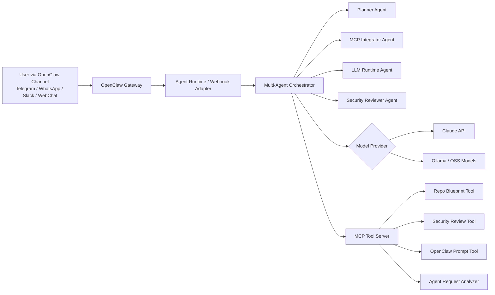

# 🦞 OpenClaw MCP Agentic Lab

[](https://github.com/m-aboud/openclaw-mcp-agentic-lab/actions/workflows/ci.yml)
[](https://www.python.org/)
[](https://modelcontextprotocol.io/)
[](https://docs.claude.com/)
[](https://ollama.com/)
[](LICENSE)

A portfolio-grade **multi-agent AI engineering showcase** demonstrating how to build an agentic system that connects:

- **OpenClaw-style messaging gateway** → WhatsApp / Telegram / Slack / WebChat style agent entry point
- **MCP server** → standardized tools exposed to AI clients
- **Claude API** → commercial frontier model option
- **Ollama / OSS models** → local/self-hosted model option
- **Multi-agent orchestration** → planner, MCP integrator, model engineer, security reviewer

This repository is designed for interviews where the company asks:

> “Have you dealt with MCP, Claude, OSS AI models, and multi-agent AI builds using OpenClaw?”

## Why this repo exists

Most AI demos are simple chatbots. This project shows a more realistic engineering pattern:



## What it demonstrates

| Area | What this repo proves |
|---|---|
| **Agentic AI** | Multi-agent task decomposition, role-based reasoning, structured outputs |
| **MCP** | A real Python MCP server exposing tools, resources, and prompts |
| **Claude** | Optional Claude provider with API integration pattern |
| **OSS AI Models** | Ollama provider for Qwen, Llama, Mistral, DeepSeek, Gemma, etc. |
| **OpenClaw** | Agent profile, gateway config example, and webhook adapter pattern |
| **Production Thinking** | Docker, CI, tests, security notes, environment separation |

## Repo structure

```text
openclaw-mcp-agentic-lab/
├── src/agentic_lab/
│   ├── agents.py              # Multi-agent orchestration
│   ├── api.py                 # Webhook adapter for OpenClaw-style gateway flows
│   ├── cli.py                 # Local demo CLI
│   ├── mcp_server.py          # MCP server exposing tools
│   ├── models.py              # Claude / Ollama / Mock provider abstraction
│   ├── schemas.py             # Typed dataclasses and payloads
│   └── tools.py               # Deterministic business tools
├── configs/
│   ├── openclaw.agent.md      # OpenClaw-facing agent operating profile
│   ├── openclaw.example.json5 # Example OpenClaw gateway config snippet
│   └── claude_desktop_config.example.json
├── docs/
│   ├── ARCHITECTURE.md
│   ├── MCP_SECURITY.md
│   ├── OPENCLAW_SETUP.md
│   ├── INTERVIEW_TALK_TRACK.md
│   └── ROADMAP.md
├── examples/
│   ├── demo_request.md
│   └── demo_output.json
├── tests/
├── Dockerfile
├── docker-compose.yml
├── Makefile
├── pyproject.toml
└── .github/workflows/ci.yml
```

## Fast start

```bash
git clone https://github.com/m-aboud/openclaw-mcp-agentic-lab.git
cd openclaw-mcp-agentic-lab
python -m venv .venv
source .venv/bin/activate
pip install -e ".[dev]"
cp .env.example .env
```

Run the local deterministic demo first:

```bash
agentic-lab run-demo --provider mock
```

Run with Ollama:

```bash
ollama run qwen2.5:7b
agentic-lab run-demo --provider ollama --model qwen2.5:7b
```

Run with Claude:

```bash
export ANTHROPIC_API_KEY="your_key_here"
agentic-lab run-demo --provider claude --model claude-opus-4-8
```

Start the MCP server:

```bash
agentic-lab mcp-server
```

Start the OpenClaw-style webhook adapter:

```bash
uvicorn agentic_lab.api:app --host 0.0.0.0 --port 8080
```

Run the full quality gate locally (same checks as CI):

```bash
make lint        # ruff
make typecheck   # mypy
make test        # pytest
```

## Demo prompt

```text
Build a multi-agent assistant that receives tasks through OpenClaw,
uses MCP tools for repository planning and security review,
and can switch between Claude and local OSS models.
```

Expected behavior:

1. Planner agent breaks the goal into deliverables.
2. MCP integrator maps the right tools and server contracts.
3. Model engineer decides Claude vs Ollama runtime strategy.
4. Security reviewer identifies MCP, prompt-injection, secrets, and tool-abuse risks.
5. Final answer returns an implementation blueprint.

## MCP tools exposed

| Tool | Purpose |
|---|---|
| `analyze_agent_request` | Classifies an agent request and extracts target capabilities |
| `generate_repo_blueprint` | Produces a GitHub-ready architecture and file structure |
| `security_review` | Reviews an agentic workflow for safety and production risks |
| `create_openclaw_agent_prompt` | Generates an OpenClaw-facing system profile |

## Claude Desktop MCP config example

Update the command path to your local repo path:

```json
{
  "mcpServers": {
    "openclaw-agentic-lab": {
      "command": "python",
      "args": ["-m", "agentic_lab.mcp_server"]
    }
  }
}
```

## OpenClaw-facing concept

OpenClaw acts as the channel gateway. This repo provides:

- `configs/openclaw.agent.md` — the agent behavior profile
- `configs/openclaw.example.json5` — sample OpenClaw gateway hardening snippet
- `src/agentic_lab/api.py` — webhook-style adapter for routing messages into the orchestrator

The exact OpenClaw channel/plugin wiring may vary by deployment, but the agent logic here is intentionally independent and portable.

## Security-first design

This repo intentionally includes security controls because MCP and agentic systems can be dangerous if tools are exposed carelessly.

Key controls:

- No shell execution tools by default
- No file write access in MCP tools
- No credential logging
- Explicit model provider selection
- Deterministic mock mode for tests
- Human-readable threat model in `docs/MCP_SECURITY.md`

> **Note on the webhook adapter:** the `/openclaw/message` endpoint is **unauthenticated by default** so the local demo works out of the box (the placeholder `AGENTIC_LAB_API_KEY=change-me-local-dev` disables the header check). Before exposing the API beyond localhost, set `AGENTIC_LAB_API_KEY` to a real secret and send it as the `x-agentic-lab-key` header. See the production hardening checklist in `docs/MCP_SECURITY.md`.


## Suggested GitHub topics

```text
openclaw mcp model-context-protocol claude ollama multi-agent-agents agentic-ai qwen llama mistral deepseek fastapi ai-infrastructure
```

## License

MIT
