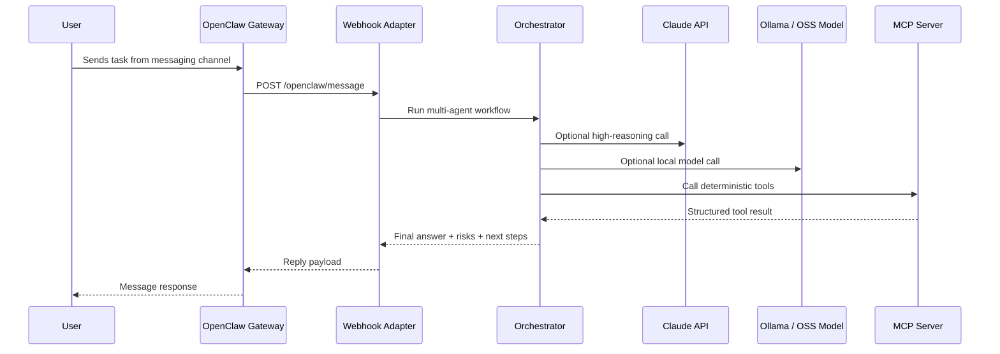

# Architecture

## Design goal

This project demonstrates a practical agentic AI platform pattern rather than a chatbot-only demo.

## Core pattern

## Components

### 1. Gateway layer

OpenClaw is treated as the channel gateway. It handles user access through messaging surfaces such as Telegram, WhatsApp, Slack, or WebChat.

### 2. Adapter layer

`agentic_lab.api` exposes `/openclaw/message`. This keeps the agentic system decoupled from any one channel implementation.

### 3. Orchestration layer

`MultiAgentOrchestrator` runs four specialist agents:

| Agent | Responsibility |
|---|---|
| Planner | Breaks the user goal into deliverables |
| MCP Integrator | Maps tools, schemas, and integration boundaries |
| Model Runtime Engineer | Chooses Claude vs OSS model strategy |
| Security Reviewer | Reviews prompt-injection, tool abuse, secrets, and access risks |

### 4. Model provider layer

Provider selection is controlled by environment variables or CLI flags.

| Provider | Use case |
|---|---|
| `mock` | Deterministic demo and tests |
| `claude` | Advanced reasoning using Anthropic Claude |
| `ollama` | Local OSS models such as Qwen, Llama, Mistral, DeepSeek, Gemma |

### 5. MCP layer

`agentic_lab.mcp_server` exposes tools that can be consumed by MCP-compatible clients.

## Why this is strong for interviews

It shows the candidate understands:

- agent gateway/channel separation
- tool protocol standardization
- model abstraction
- local-first AI
- production safety controls
- tests and deployability
